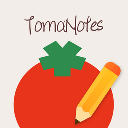

<div align="center">
  
  <h1>TomaNotes</h1>
  <p><b>Secure, Local-first Note-taking for macOS.</b></p>
  <p>一款安全、本地优先的 macOS 笔记工具。</p>

  <p>
    
    
    
  </p>
</div>

---

## 中文 | Chinese

### 功能

- **双编辑器引擎** — 在 Tiptap 富文本（表格、链接、图片、文件附件）和 CodeMirror Markdown 实时预览之间无缝切换。
- **TMN 跨平台格式** — 导出/导入 `.tmn` 文件，与 [Notiee](https://github.com/idbetterrun/notiee)（iOS AI 照片笔记）无损互通。
- **分层安全** — 全局 6 位 PIN 码 + macOS Touch ID 生物识别认证 + 逐笔记加密 + 空闲自动锁定。
- **完整国际化** — 英语、简体中文、繁体中文。
- **5 种主题** — 白色、灰色、仿古、暗调、黑色。
- **独立窗口** — 在独立的 Electron 窗口中打开笔记。
- **标签、收藏、回收站** — 完整的笔记组织体系，支持搜索和筛选。

### 支持的文件格式

| 格式 | 说明 |
|------|------|
| `.tmn` | TomaNote Markup — ZIP 封装的跨平台笔记格式，支持与 Notiee 互通 |
| `.txt` | 纯文本文件导入导出 |
| `.md` | Markdown 文件导入导出，与 CodeMirror 编辑器深度集成 |

### 技术栈

| 层级 | 技术 |
|---|---|
| 运行时 | Electron 41 |
| 前端 | React 18 + Vite 5 |
| 样式 | Tailwind CSS 4 + CSS 自定义属性 |
| 富文本 | Tiptap 3 (ProseMirror) |
| Markdown | CodeMirror 6 + react-markdown |
| 动效 | Framer Motion |
| 图标 | Lucide React |
| 压缩 | JSZip (TMN 格式) |

### 快速开始

```bash
git clone https://github.com/idbetterrun/TomaNotes.git
cd TomaNotes
npm install

# 开发模式
npm run dev      # 启动 Vite 开发服务器
npm start        # 在开发模式下运行 Electron

# 构建
npm run build:mac   # 打包 macOS .dmg 安装包
```

### TMN 格式

`.tmn`（TomaNote Markup）是一种基于 ZIP 的文档格式，与 [Notiee](https://github.com/idbetterrun/notiee) 共享。它将 JSON 元数据、内容和二进制附件打包为单个可移植文件。

```
example.tmn
├── manifest.json     # 元数据、来源应用、文件索引
├── content.json      # 标题、内容（HTML/Markdown/纯文本）、标签、加密信息
└── attachments/      # 图片、文件
```

| 导出方 → 导入方 | 行为 |
|---|---|
| TomaNotes → Notiee | 富文本自动转换为纯文本供 Notiee 显示；原始内容保留用于回传 |
| Notiee → TomaNotes | AI 处理后的内容以完整保真度导入；编辑器元数据恢复 |

---

## English

### Features

- **Dual Editor Engine** — Switch seamlessly between Tiptap Rich Text (tables, links, images, file attachments) and CodeMirror Markdown with live preview.
- **TMN Cross-platform Format** — Export/import `.tmn` files for lossless round-trip with [Notiee](https://github.com/idbetterrun/notiee) (iOS AI photo note).
- **Layered Security** — Global 6-digit PIN + macOS Touch ID biometric auth + per-note encryption + auto-lock after idle.
- **Full i18n** — English, Simplified Chinese, Traditional Chinese.
- **5 Themes** — White, Gray, Sepia, Dim, Black.
- **Detached Windows** — Open notes in separate Electron windows.
- **Tags, Favorites, Trash** — Full note organization with search and filter.

### Supported File Formats

| Format | Description |
|--------|-------------|
| `.tmn` | TomaNote Markup — ZIP-based cross-platform note format, interops with Notiee |
| `.txt` | Plain text import/export |
| `.md` | Markdown import/export, deeply integrated with the CodeMirror editor |

### Tech Stack

| Layer | Technology |
|---|---|
| Runtime | Electron 41 |
| Frontend | React 18 + Vite 5 |
| Styling | Tailwind CSS 4 + CSS custom properties |
| Rich Text | Tiptap 3 (ProseMirror) |
| Markdown | CodeMirror 6 + react-markdown |
| Animation | Framer Motion |
| Icons | Lucide React |
| ZIP | JSZip (TMN format) |

### Getting Started

```bash
git clone https://github.com/idbetterrun/TomaNotes.git
cd TomaNotes
npm install

# Development
npm run dev      # Vite dev server
npm start        # Electron in dev mode

# Build
npm run build:mac   # Package macOS .dmg
```

### TMN Format

`.tmn` (TomaNote Markup) is a ZIP-based document format shared with [Notiee](https://github.com/idbetterrun/notiee). It bundles JSON metadata, content, and binary attachments into a single portable file.

```
example.tmn
├── manifest.json     # Metadata, app origin, file index
├── content.json      # Title, content (HTML/Markdown/Plain), tags, encryption
└── attachments/      # Images, files
```

| Export From → Import To | Behavior |
|---|---|
| TomaNotes → Notiee | Rich text auto-converts to plain text for Notiee display; original preserved for round-trip |
| Notiee → TomaNotes | AI-processed content imported with full fidelity; editor metadata restored |

## License

MIT — Copyright © 2025 Tan Qinghua
